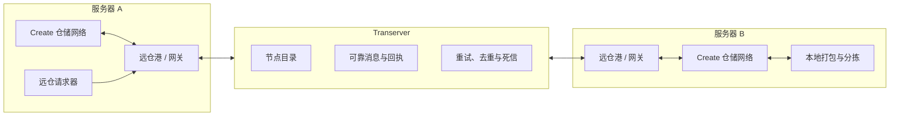
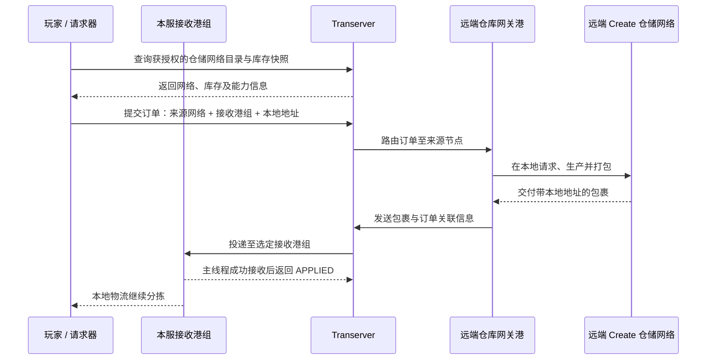
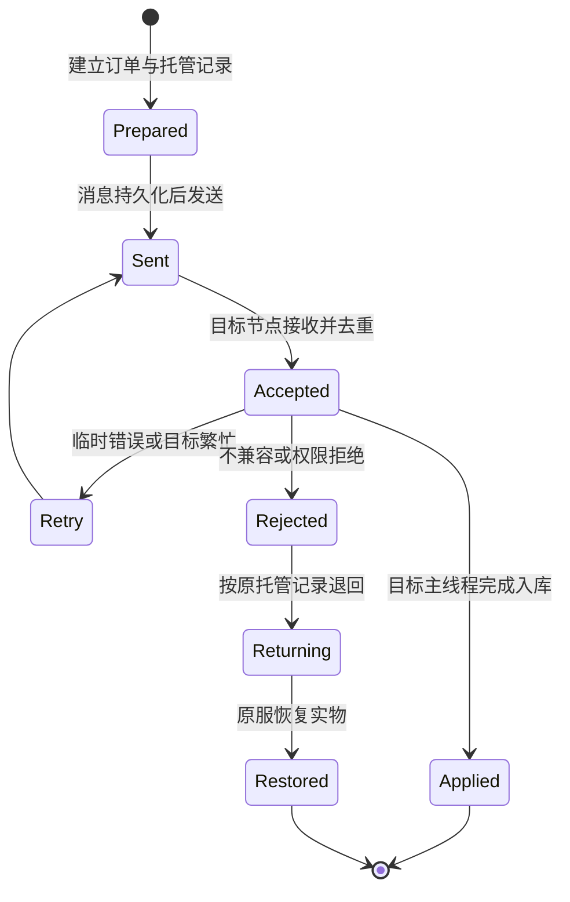

# 机械动力：远仓——项目说明、现状与开发计划

> 文档状态：开发中 · 方案整理稿  
> 整理日期：2026-09-09  
> 当前工程版本：`0.3.7`（Minecraft 1.21.1 / NeoForge / Create 6.0.10）

## 1. 项目简介

**机械动力：远仓（Create: Distant Stock）** 是一个面向多服务器环境的机械动力附属模组。它希望让分散在不同服务器、世界与维度中的工厂继续保有各自独立的机械动力物流网络，同时能够安全地查询库存、发起生产请求、打包货物并将包裹送往另一处工厂。

远仓并不尝试把几张机械动力物流网粗暴地合并成一张“超级物流网”。它建立的是一层跨服仓储与运输协议：每座工厂仍由本地的仓储链接、打包机、传送带、漏斗和蛙港负责实际生产与分拣；远仓只负责让这些彼此独立的工厂能够发现对方、提出请求，并可靠地交换包裹。

项目希望同时照顾两类玩家：

- 只想快速寄送包裹的玩家，可以像使用运输蜂停泊港一样，在各服放置远仓港、加入同一频道，随后直接寄件。
- 已经建设大型自动化工厂的玩家，可以让远仓港作为整张本地仓储网络的跨服网关，不必拆除原有仓储链接、打包机或重铺整条产线。

一句话概括：

> **远仓连接工厂，但不取代工厂；传递包裹，但不假装理解玩家亲手搭建的每一段物流。**

## 2. 项目原则

目前的设计遵循以下原则。这些原则比某个方块的具体造型或某个字段的名称更加稳定。

1. **支持多服务器，而非只支持两台服务器。** 网络模型必须允许一组服务器共同接入，并支持一网多港、多网多港。
2. **地址与服务器连接信息分离。** 包裹和存档只保存稳定标识，不保存 IP、域名或端口。管理员更换 ZeroTier 地址或域名后，旧包裹仍应可投递。
3. **远仓港属于物流网络，但不与另一座港一对一耦合。** 包裹携带目的节点与接收港组，任意合适的发送港都可以转交它。
4. **不猜测玩家的物理物流布局。** 系统无法凭空知道一条皮带通往哪里。发送港的本地收件地址、接收港组以及最终本地包裹地址必须由玩家明确配置。
5. **兼容现有工厂。** 老工厂只需在合适位置增加远仓港并完成绑定；不强制替换原版打包机，也不要求为每个库存单独增设远仓设备。
6. **物品安全优先于“看起来成功”。** 遇到断线、重启、模组不一致或目标服拒收时，系统应保留、重试、退回或隔离物品，不能静默吞掉。
7. **Transerver 与远仓保持边界。** Transerver 提供通用、可靠的服务器间消息传输；远仓负责 Minecraft、Create、仓储网络、包裹和玩家交互。
8. **核心标识与协议不可写死。** 服务器、世界、网络、港组和订单均使用可扩展的稳定标识，为未来的流体港、能量港及第三方接口预留空间。

## 3. 总体架构

整个系统分为三层：本地机械动力物流、远仓玩法逻辑、Transerver 可靠传输。

### 3.1 DistantStock（远仓模组）

远仓以独立 Minecraft 模组 JAR 发布，负责：

- 注册方块、物品、菜单、贴图、思索场景和玩家交互；
- 读取机械动力本地仓储网络的库存快照；
- 创建订单并调用本地机械动力打包逻辑；
- 将普通包裹或远仓包裹送入跨服流程；
- 管理远仓港、接收港组、本地地址和网络绑定；
- 在目标服主线程校验并还原包裹；
- 显示链路、TPS、队列和异常状态。

### 3.2 Transerver（前置传输库）

Transerver 是另一个独立 JAR。它不认识方块、物品或机械动力仓库，只负责通用的跨服消息传输：

- 稳定的节点身份与节点目录；
- 持久化发件箱、收件箱和路由中继；
- 消息 ID、关联 ID、校验摘要与负载上限；
- `APPLIED`、`RETRY`、`REJECTED` 等明确回执；
- 至少一次投递、幂等去重、失败重试和死信记录；
- 基于 HMAC 的节点认证；
- 使用本地持久化，不要求管理员额外部署 MySQL。

两者保持独立，是为了让传输层可以被测试、升级和复用，也避免远仓的游戏内容被某种固定网络拓扑绑死。最终发布时，远仓将通过稳定的适配接口调用 Transerver，而不是把地址解析、重试和可靠性逻辑散落在各个方块中。

## 4. 核心概念与标识

为了把多服务器、多世界、多物流网和多个港口讲清楚，系统使用不同层级的标识。玩家界面以名称为主，内部协议使用稳定 ID。

| 概念 | 用途 | 是否由玩家直接填写 |
|---|---|---:|
| `nodeId` | 标识一台接入 Transerver 的服务器节点 | 否，由管理员配置或生成 |
| `worldId` / `dimensionId` | 区分同一服务器中的世界与维度，兼容 Multiverse 等多世界方案 | 否 |
| `networkId` | 标识一张可被远程访问的 Create 仓储网络 | 否，系统登记 |
| 访问频道 / 密钥 | 让个人或团队发现并使用获准的远程资源 | 是，以友好方式输入或邀请加入 |
| `dockGroupId` | 标识一个接收港组；显示名可修改，内部 ID 不变 | 通常不直接显示 UUID |
| 本地包裹地址 | 包裹到达某服务器后交给 Create 本地分拣系统使用 | 是 |
| `orderId` / `correlationId` | 跟踪订单、子订单、回执与退件 | 否 |

其中，`networkId` 由节点、世界、维度和本地网络身份共同确定。这样可以避免不同服务器恰好使用相同频率时发生碰撞，也为多世界插件兼容留下明确边界。

需要特别说明：

- **访问密钥不等于港组 ID。** 密钥用于授权和发现，港组用于投递。
- **港组名称不等于物理地址。** 玩家可以把港组命名为“主城收货”“铁路工厂”，内部仍使用不可随意碰撞的稳定 ID。
- **跨服路由不等于 Create 包裹地址。** 前者把包裹送到正确服务器和港组；后者只在落地后指导本地皮带与蛙港分拣。

## 5. 两种主要玩法

### 5.1 快速寄件模式

这是最容易上手的模式，适合不需要远程浏览仓库、只想跨服运送现成包裹的玩家。

1. 玩家在两台或多台服务器分别放置远仓港。
2. 各远仓港加入同一获授权频道，并设置清晰的站点或港组名称。
3. 发送港设置一个默认目的港组，或者由之后的包裹标记功能为单个包裹指定目的地。
4. 玩家把机械动力普通包裹送入发送港。
5. 远仓港保留包裹原有的本地地址，并增加跨服路由信封。
6. 包裹到达目标接收港组后，被交给目标服本地物流继续运输和拆包。

这个模式不要求港口绑定仓储网络，也不要求使用远仓打包机。远仓打包机是一种适合新工厂的便利设备和主题外观，而不是使用跨服运输的强制门槛。

### 5.2 远程仓储请求模式

这是完整的远仓玩法。远端请求器能够查看获授权仓储网络的库存，并请求其中的物品或生产任务。

玩家下单时需要明确三件事：

1. **从哪张远程仓储网络取货；**
2. **送到本服哪个接收港组；**
3. **落地后使用什么本地包裹地址。**

请求流程如下：

### 5.3 为什么不自动识别所有路线

远仓可以识别“这个港属于哪张仓储网络”，却不能可靠推断“玩家铺设的这条皮带最终会把什么送到哪个港”。因此：

- 网络目录和库存可以自动登记；
- 港组可以自动列出并由玩家选择；
- 发送港的本地收件地址仍需玩家设置；
- 包裹落地后的最终本地地址仍由下单者或预设填写。

这不是系统能力缺失，而是对机械动力开放式建造玩法的尊重。明确配置比错误猜测更可靠，也更容易排障。

## 6. 远仓港：运输端口与网络网关

远仓港是当前方案中最重要的方块。发送与接收使用同一种远仓港，不再额外增加“发送港”“接收港”或“远仓仓储链接器”。

### 6.1 作为物理端口

- 六面均应能够与漏斗、溜槽、传送带等物流装置交互，但**底面是回退面**：它只允许投入，任何装置都无法从底面抽出包裹，只有港自己把退件与被剔除的物品推到下方容器；
- 接受机械动力普通包裹和远仓包裹；
- 根据包裹的稳定路由信息投递，而不是按固定 IP 或一对一配对投递；
- 接收时保留原始内容与本地包裹地址；
- 一个接收港组可以包含多个港，并采用可解释的负载分配规则；
- 港组不可用时不得随意改投其他组，以免货物进入错误工厂；
- 无法处置的东西回到玩家自己的物流，不集中到全服公共位置；下方没有可接收的容器时亮橙灯并保留内容。

### 6.2 作为仓储网关

当远仓港绑定到本地 Create 仓储网络后，它同时承担网关职责：

- 向目录登记本地网络及其公开能力；
- 提供经过权限过滤的库存快照；
- 接收发往该网络的远程订单；
- 把远程订单转换为本地 Create 请求；
- 收取本地打包结果并交给 Transerver。

这样，现有工厂只需增加一个合适位置的远仓港，不必给每台原版打包机做远仓改造，也不必重建完整物流网络。

### 6.3 多港与多网

设计允许：

- 一张仓储网络连接多个远仓港；
- 一个接收港组包含多个远仓港；
- 一台服务器承载多张仓储网络；
- 多个服务器共同组成一套远仓体系；
- 同一位玩家或团队维护多个彼此隔离的频道。

“一网多港”和“一港对多目的地”都成立。港口不是固定隧道口，目的地由订单或包裹本身决定。

## 7. 请求器与界面

项目包含放置式远仓请求台和便携式远仓请求器。二者共享同一套仓储浏览与下单逻辑。

### 7.1 界面方向

请求器界面沿用机械动力原版仓储请求界面的布局和操作习惯，并采用远仓包裹的低饱和淡蓝灰主题。当前设计已经增加或规划以下路由字段：

- 来源仓储网络；
- 本地地址；
- 接收港组；
- 包裹落地后的地址；
- 必要时显示权限、在线状态和兼容性提示。

物品格背景和地址标签也统一为淡蓝灰色系，避免只更换大背景而留下原版暖色格子造成割裂。

### 7.2 跨服绑定

请求器不会隔着服务器直接“调谐”远端 Stock Link。正确方式是：

1. 远端网关港在本地绑定 Create 仓储网络；
2. 网关向 Transerver 目录登记一个稳定 `networkId`、显示名和访问策略；
3. 请求器通过频道、邀请或权限查询可见网络；
4. 玩家从列表选择网络并完成绑定；
5. 请求器保存 `networkId`，不保存 IP，也不直接保存容易碰撞的本地频率。

服务器地址变化时，只需要管理员更新节点目录。已经存在的请求器、订单和包裹无需因此报废。

## 8. 包裹、订单与完整生命周期

跨服运输不是一次简单的 HTTP 上传。每个包裹都必须有可追踪、可恢复的生命周期。

### 8.1 建议状态

### 8.2 安全不变量

任何时刻，每份货物都必须有且只有一位明确的“保管者”：

- 仍在来源库存中；
- 已被来源服托管；
- 正在 Transerver 的持久队列中；
- 已由目标服接收；
- 或位于人工可见的隔离区。

来源服在发送前建立 `EscrowRecord`（托管记录）。只有目标服主线程真正把包裹放入可恢复容器或港口缓冲区，并返回 `APPLIED` 后，来源服才可删除托管记录。网络请求成功、目标节点收到字节、NBT 可以解码，都不能单独视为最终成功。

### 8.3 幂等与重试

- 同一个 `messageId`、`orderId` 或子订单不得产生两份货物；
- 目标节点重复收到消息时应返回既有结果，而不是重复创建包裹；
- 临时离线、队列满或区块未加载应进入重试；
- 达到策略上限后应进入可见的死信或隔离状态，不能静默删除；
- 管理员和玩家应能查看失败原因，并选择重试、退回或导出诊断信息。

## 9. 模组差异与不兼容物品

不同服务器安装不同模组，是远仓必须正面解决的问题。系统不应要求整组服务器拥有完全相同的模组列表，而应检查实际包裹中引用的内容。

### 9.1 两阶段检查

1. **发送前预检。** 根据目标节点公布的能力摘要，提前提示明显缺失的物品、组件、附魔或数据类型。预检只用于改善体验，不能作为唯一依据。
2. **目标服权威校验。** 目标节点使用自身注册表与反序列化规则检查真实负载。只有校验通过并成功放入目标缓冲区，才返回 `APPLIED`。

### 9.2 默认处理策略

| 情况 | 默认处理 |
|---|---|
| 目标服暂时离线 | 保留托管记录并重试 |
| 目标服缺少物品注册项 | 目标回报缺失清单，来源整件剔除命中条目；剩余内容限次重发，剔除物从港回退面交给玩家 |
| 目标服缺少必要数据组件 | 同上；若命中条目无法在包裹内容里定位，则整包从回退面退出并置故障灯 |
| 可无损迁移的数据版本差异 | 经明确迁移器转换后再校验 |
| 只能有损降级 | 默认拒绝，不把未知物品偷偷变成空气或普通物品 |
| 来源港不存在或未加载 | 保留托管记录并重试；宽限期后进入服务器退件箱，玩家正常路径不经过它 |
| 来源服连原始托管数据都无法解码 | 放入隔离库并通知管理员 |
| 重复消息或重复回执 | 按稳定 ID 去重，维持原结果 |

跨服安全检查关注的是包裹实际使用的注册项和数据，而不是简单比较整份模组列表。这样，服务器 B 可以安装服务器 A 没有的装饰模组，只要本次包裹不包含相关内容，就不影响运输。

剔除的边界（详见 `docs/design/RETURN-FACE.zh-CN.md`）：

- 缺模组的物品在目标服**无法实例化**，所以"清理出来"只能发生在来源服，目标服只负责报告缺什么；
- 粒度是整件物品，不做半拆数据组件；
- 每次剔除与重发都必须先扣住物品再销账，**零剔除不重发**，单件包裹最多重发 3 次；
- 剔除物与无法处置的包裹从远仓港底面的回退面交付给玩家自己的物流，**不集中到全服公共位置**；没有可交付的容器时亮橙灯并保留内容。

### 9.3 退件必须使用原始托管数据

退件时不依赖目标服重新序列化一份“看起来相同”的物品，而应恢复来源服发送前保存的原始托管记录。这样可以避免目标服无法识别某个物品时，连退件内容也被破坏。剔除后的包裹会重算清单与 SHA-256，但物品本身始终来自托管记录里的原始 NBT。

## 10. 设备与物品清单

下表使用四种状态：

- **已实现**：已注册并具有可运行代码；仍可能继续调整。
- **可运行原型**：已经能够验证流程，但尚未达到最终发布架构或美术标准。
- **设计确认**：职责和方向已经明确，代码尚未完整落地。
- **方案讨论中**：名称、数值、结构或美术仍需共同决定。

### 10.1 已注册或正在工程中使用的内容

| 内容 | 当前状态 | 说明 |
|---|---|---|
| 远仓港 | 已实现 / 持续改造 | 已有方块、实体、物品交互与基础收发；港组和网关职责正在并入新路由方案 |
| 远仓请求台 | 已实现 / 持续改造 | 工程内部仍使用 `gauge` 代码名；共享仓储请求界面 |
| 便携式远仓请求器 | 已实现 | 可手持打开请求界面，外观参考机械动力附属的物流设备语言 |
| 远仓监视器 | 已实现 / 持续美化 | 已能表现 TPS 与链路状态，指示灯按绿、橙、红变化；最终面板贴图仍可继续打磨 |
| 远仓打包机 | 可运行原型 | 淡蓝色 Create 打包机变体；用于新建工厂更方便，但不会成为旧工厂的强制改造项 |
| 远仓包裹 | 可运行原型 | 保留包裹内容和地址数据；色调已调整为低饱和灰白带淡蓝 |
| 远仓说明书与思索 | 已实现 / 待更新 | 已有基础教程；需要在新路由、港组和 Transerver 接入后重新编排 |
| 请求器淡蓝界面 | 可运行原型 | 已完成主题化背景、物品格和路由标签方向；字段交互还需随最终协议完善 |

### 10.2 已确定方向、尚未完整注册的内容

| 内容 | 当前状态 | 说明 |
|---|---|---|
| 远仓机壳（闭合） | 美术方向已选定 | 使用统一淡蓝灰主题，连接建造时边框应自然合并；原方案保留归档但不再使用 |
| 远仓机壳（激活） | 设计确认 | 红石使能后边框发光、中部透明，可作为工厂车间玻璃；边框不消失 |
| 远仓仪表 | 设计确认 | 与机械动力工厂仪表相同的交互语言，用于跨服请求物品生产；不是 TPS 监视器 |
| 以太石英 | 概念贴图完成 | 基础淡蓝白材料，属于以太材料体系 |
| 磨制以太石英 | 概念贴图完成 | 由以太石英加工得到，是机壳与高阶部件的原料 |
| 高阶以太材料 | 方案讨论中 | 晶体外形已探索棱镜与紫水晶轮廓；中文名称尚未完全冻结，曾讨论直接称“以太” |
| 粉碎末影珍珠 | 概念贴图完成 | 用于体现空间与传送属性的配方材料 |
| 熔融紫水晶 | 设计确认 / 概念贴图完成 | 高温中间流体，由紫水晶相关工序获得 |
| 以太凝液（暂名） | 方案讨论中 | 英文采用 `Ether` 词根；用途与色系已明确，最终中文名和完整配方仍待确定 |

### 10.3 互通塔相关部件

| 内容 | 当前状态 | 说明 |
|---|---|---|
| 互通塔底座 | 方案讨论中 | 倾向 3×3 或 5×5，由远仓机壳组成 |
| 流体接口面 | 设计确认 | 对底座机壳某一面使用扳手，将其设置为流体接口并切换对应材质 |
| 耦合器柱 | 方案讨论中 | 以一格宽柱体连接底座与顶部；外观应借鉴打包机边框，而不是现代电子设备 |
| 以太谐振器 | 方案讨论中 | 位于顶部；整体语言应更接近安山机壳体系，中部旋转结构尚未最终确认 |
| 世界互通塔 | 概念确认 / 规则待定 | 面向全服玩家共同建设的巨型设施，可激活全世界范围的远仓设备 |

## 11. 互通塔系统

互通塔是远仓的中后期基础设施，也是最需要继续讨论的部分。目前已经形成的共识如下。

### 11.1 普通互通塔

- 玩家自行搭建必要核心，外部装饰可以自由发挥；
- 底座倾向采用 3×3 或 5×5 远仓机壳结构；
- 顶部为以太谐振器，中间以一格宽的耦合器柱连接；
- 底座与顶部的距离决定塔的等级，并设置合理上限；
- 等级影响可带载的远仓设备数量、激活范围和区块加载范围；
- 塔需要机械动力应力输入，并与以太流体体系发生关系；
- 后续的流体远仓港、能量远仓港可以复用这一激活与带载机制，但不属于当前首发范围。

### 11.2 世界互通塔

世界互通塔不是普通塔简单放大后的装饰物，而是一项全服共同建设的长期工程。其目标是：

- 激活整个世界或服务器范围内的远仓设备；
- 为大型服务器提供公共基础设施；
- 通过持续维护或资源供应形成多人协作玩法；
- 与普通互通塔形成清晰的前期/后期关系。

### 11.3 已实现的部分

前面几节是方案讨论，以下是**代码里已经定下来**的部分，写在这里以免文档和实现继续分家。

**等级表**（`block/TowerTier.java`）。数值写在代码里而不是配置里——一个数字一条配置就是 35 条，调不动。

| 等级 | 耦合器 | 带载设备 | 激活半径 | 区块边长 | 应力 |
|---|---|---|---|---|---|
| I | 5 | 8 | 32 | 1×1 | 256 |
| II | 7 | 16 | 40 | 3×3 | 512 |
| III | 9 | 32 | 48 | 3×3 | 1024 |
| IV | 11 | 48 | 64 | 5×5 | 2048 |
| V | 13 | 64 | 80 | 5×5 | 4096 |
| VI | 15 | 96 | 112 | 7×7 | 8192 |
| VII | 17 | 128 | 144 | 7×7 | 16384 |

区块加载**故意涨得比其它慢**：III 到 IV 设备数翻倍、半径涨三分之一，但加载面积不动。面积每档都涨的话，最后几档的服务器开销会超过任何建筑值这个价。它在 III、V、VII 才动。

超过 17 个耦合器不再涨级，但塔照常工作、读数显示「已封顶」——堆多了一格就要把整根桅杆拆开找是哪一格，那是最差的体验。

**结构判据**（`block/TowerStructure.java`）：塔 = 底座 + 连续的耦合器 + 顶上的谐振器，桅杆必须落到底座上。判据只写一次，渲染器、底座方块实体、护目镜读数共用。

**动能**：底座是 Create 的动能方块，**只在底面接轴**（3×3 裙板就在同一层，侧面接轴得穿过机壳），转速门槛 30 rpm。应力按等级扣再乘转速，所以一座 VII 级塔在高速网络上要 16384 起步。

**计费**：每个包裹 `250 mB` 以太凝液，**扣费点在塔不在港**；塔底座带一个储罐供管道灌注。`tower.chargeParcels` 默认**关闭**——测试阶段先不消耗；收不到费的包裹留在港里，绝不发了不扣或扣了不发。

### 11.4 塔是设备工作的前提（用户定案）

**一个维度里只要有一座塔在转，这个维度里的远仓设备就全部进入门禁状态：被某座塔的半径罩住的才工作，罩不住的就停。**

没塔的维度一切照旧——这是为了不动现有存档。但「塔是激活设备的前提」是有意为之，不是副作用：

- 想要远距离物流，就得先建塔，并且把设备建在塔够得着的地方；
- 因此**每套系统都得有自己的塔**，塔不是可选装饰；
- 一座建好但**没在转**的塔不认领维度也不带载——断轴降级成「这座塔是暗的」，而不是「整个维度的港全黑且看不出为什么」。这是刻意的：出故障时要能一眼看出是哪台机器。

注意这条的边界：**门禁按维度生效，不是按半径生效**。半径决定的是「谁被带载」，维度决定的是「这个维度要不要门禁」。所以在一个有大塔的维度里，离塔很远的港也会停。

### 11.4 监视器对塔的控制

**每座塔各自一份设置，以塔底座为中心，不是以监视器为中心，也不是整个系统共用一个。**

| 项 | 语义 |
|---|---|
| 半径 | 从**该塔底座所在区块**向外扩张多少格。可设范围 `0 .. 该塔等级的半径上限`，**只能往小里设** |
| 参与区块加载 | 关掉 = 这座塔**一格都不加载**，连它自己所在那格也不加载 |
| 参与带载设备 | 关掉 = 这座塔不再承载远仓设备，但它的读数照常显示 |

半径上限从等级表的边长换算：`半径上限 = (边长 - 1) / 2` → I 级 0、II/III 级 1、IV/V 级 2、VI/VII 级 3。实际加载区块数 = `(2r+1)²`。

**「关掉」和「半径 0」是两件不同的事**：关掉是一格都不加载，半径 0 是只加载它自己那一格。界面上必须能看出区别。

**越限的输入要拒绝并给出理由，不能静默夹到上限**——静默夹看起来和成功一模一样，操作员会一直以为塔覆盖着它其实没覆盖的地方。

**超出上限时存回去的仍是填的那个数。** 桅杆拆矮之后，塔不能继续占着它现在付不起的地方（所以实际执行时夹到上限），但重新搭回去要能恢复操作员当初要的值（所以存储值不动）。

**一座塔的开关不影响同系统里别的塔。** 系统只是「范围恰好相交的一组塔」，不是一台有统一旋钮的机器。

**合计预算**是服务器级的（`tower.maxSelectedChunks`），按**写入之后**的文件内容算，超了整个拒绝、不部分生效。

**监视器只能配置它看得见的塔**，并且所有校验都在那唯一一次写入之前跑完——写之后没有会失败的步骤，所以不存在「改一半」。

### 11.4 尚未冻结的平衡问题

以下内容仍处于讨论阶段，文档暂不把任何一个答案写成最终规则：

- 普通塔是运行时持续消耗流体，还是只在建造/启动时完成注液；
- 世界互通塔是否持续消耗以太流体；
- 每个包裹固定消耗 `250 mB`，还是按物品数量、距离、跨服次数或带载量计算；
- 塔的区块加载范围与远仓设备激活范围是否完全相同；
- 3×3 与 5×5 是两种塔型、两个等级，还是允许玩家二选一；
- 世界互通塔与各世界、各维度之间如何结算覆盖范围；
- “鼓风机吹拂以太凝液并随转速消耗、由管道补充”的触媒机制是否值得作为独立加工方式实现。

已经定案、不再作为开放问题的：每个包裹固定 `250 mB`（不按距离或数量浮动）；区块加载范围与激活半径是两件事（见 11.3 的表格）；塔运行时是否**持续**消耗流体仍未定，目前只有按包裹计费。

## 12. 美术与视觉语言

远仓的美术目标不是简单把原版材质整体染蓝，而是延续 Create 的材料层次与像素涂抹感。

### 12.1 已形成的视觉共识

- 基础分辨率遵循 Minecraft 与 Create 常用的 16×16 语言；必要的模型分件可以使用独立小材质，但不追求 32×32 式过度细腻。
- 主题色为低饱和的灰白、淡蓝与少量冷青，高亮只用于接口、导轨、晶体和状态指示。
- 远仓包裹应像灰白纸箱略带蓝色，而不是整块高饱和蓝色；胶带和侧面标记也要融入同一色调。
- 远仓机壳必须拥有自己的完整主题色，不能只在其他机壳上替换中部图案。
- 机壳大面积拼接时，连接纹理和边框合并比单块图案更重要。
- 监视器要保留像素抹痕、旧式仪表和机械结构感，避免现代纯色屏幕。
- 互通塔零件应优先使用机壳、铆钉、框架、黄铜机构和可读的机械连接，避免无来由的电子管或现代科幻面板。

### 12.2 当前素材的使用原则

仓库中保留了多轮 LLM 与脚本生成的概念图。它们的职责是记录思路和对比方向，不应全部直接进入发布资源包。

- 已获认可的贴图进入 `accepted` 或正式资源目录；
- 被替换的方案保留在 `archive`，但不参与加载；
- 互通塔旧版渲染只作为历史概念，不代表最终多方块结构；
- 所有正式贴图都要在游戏内分别检查：单块、相邻拼接、大面积墙体、不同光照和实际模型 UV。

## 13. 已经完成的工作

截至本文整理时，工程已完成或具备以下基础：

### 13.1 游戏内容与交互

- 远仓港、请求台、监视器、便携请求器和说明书已经注册；
- 已有基础仓储请求界面、键位、网络菜单与思索场景；
- 请求器界面已经开始采用远仓淡蓝灰主题；
- 接收港组选择与相关订单字段已经进入工程；
- 远仓港已经具备本地物品能力和基础缓存逻辑；
- 监视器已经具备 TPS 分级状态与绿、橙、红模型表现；
- 远仓打包机和远仓包裹已形成可运行原型；
- 已有可构建的 `0.3.7` 测试 JAR。

### 13.2 当前临时跨服原型

- 已实现基础库存查询、订单提交、状态查询与包裹传送接口；
- 已验证“游戏主线程负责世界与库存操作，I/O 线程负责网络”的基本边界；
- 已有简单队列、轮询、TPS/MSPT 和链路状态展示；
- 已经证明远仓与 Create 本地打包流程可以接通。

这部分属于**验证原型**。它仍采用较早的主机/客户端 HTTP 结构、内存队列和有限重试，不能作为最终可靠传输实现。接入 Transerver 后，应逐步移除重复的地址、重试与消息生命周期逻辑。

### 13.3 协议与可靠性设计

- 已完成多服务器、多世界、多网络、多港组的路由方案整理；
- 已明确包裹不携带 IP，而使用稳定节点和港组标识；
- 已明确远仓港兼具物理端口和仓储网关职责；
- 已明确请求器通过目录发现网络，而不是隔服直接绑定 Stock Link；
- 已完成模组不一致、权威校验、托管退件、隔离和幂等设计；
- Transerver 已具备持久队列、回执、重试、去重、死信和认证基础；
- 已形成 DistantStock 与 Transerver 分离发布、通过接口接入的工程方向。

### 13.4 概念美术与素材整理

- 已探索远仓港、请求器、监视器、打包机、包裹和互通塔的视觉方向；
- 已完成远仓包裹的低饱和调整；
- 已确定新版闭合远仓机壳方向，并保留旧版但不使用；
- 已形成红石激活后透明发光机壳的核心设定；
- 已制作以太石英、磨制以太石英、流体容器和若干高阶材料概念；
- 已建立概念、入选与归档素材分流的整理思路。

## 14. 当前限制与主要风险

1. **可靠传输尚未完成迁移。** 当前游戏内跨服代码仍主要使用早期 HTTP 原型，尚未完整接入 Transerver 的托管、回执和幂等流程。
2. **现有失败路径可能丢失信息。** 旧队列的有限重试和异常解码逻辑不满足最终物品安全要求，不能直接用于公开服务器。
3. **库存目录仍需权限模型。** 需要明确公开、团队、邀请和管理员策略，以及玩家能看到多少库存与节点信息。
4. **多世界兼容尚未实装验证。** 标识方案已经纳入 `worldId` 与 `dimensionId`，但仍需用实际 Multiverse 环境测试。
5. **Create 版本适配需要隔离层。** 仓储网络和包裹内部 API 可能随 Create 版本变化，应集中封装，避免协议层依赖游戏内部对象。
6. **互通塔玩法尚未冻结。** 结构、资源消耗、等级和世界塔关系仍有争议。
7. **部分贴图仍是概念稿。** 尤其是互通塔、透明机壳连接材质、耦合器和以太谐振器，需要在真实模型与光照中重做。
8. **名称仍有未决项。** 以太流体和高阶材料的中文名需要同时满足 Minecraft 的简洁感、Create 的工程感和本项目的空间/秩序主题。

## 15. 推荐开发顺序

### 阶段 A：冻结安全边界

- 将路由字段、稳定 ID、回执状态和错误码整理为版本化协议；
- 为 Create 物品与组件建立兼容性扫描器；
- 建立来源托管记录、目标幂等记录、退件和隔离仓；
- 编写断线、重启、重复投递、模组缺失和数据损坏测试。

完成标准：任何失败场景都能说明“货物现在由谁保管、下一步会发生什么”。

### 阶段 B：接入 Transerver

- 为远仓编写窄而稳定的 Transerver 适配器；
- 用节点目录替换方块中的远程地址；
- 用持久消息和回执替换旧内存队列与有限重试；
- 保留必要的迁移兼容，但停止扩展旧 HTTP 星形拓扑。

完成标准：三台以上服务器可以互通，修改节点域名不会使旧订单和旧包裹失效。

### 阶段 C：先完成快速寄件

- 实现频道/密钥式的港口快速加入流程；
- 完成港组创建、重命名、成员港与默认目的地；
- 支持普通 Create 包裹跨服投递并保留本地地址；
- 完成港口状态、退件提示和基础管理员诊断。

完成标准：玩家无需建设远程仓库目录，也能在多服间可靠寄送普通包裹。

### 阶段 D：完成仓储网关与远程请求

- 远仓港绑定本地 Create 仓储网络并登记 `networkId`；
- 建立权限受控的网络目录与库存快照；
- 完成请求器的来源网络、接收港组和本地地址交互；
- 完成订单拆分、生产请求、部分履约、取消与回执；
- 更新说明书与思索，明确玩家需要配置的本地地址。

完成标准：现有工厂增加一个网关港后，即可被获授权请求器查询和下单。

### 阶段 E：设备、美术与多世界

- 完成远仓机壳两个状态及连接材质；
- 完成监视器、打包机、远仓仪表和端口模型；
- 在实际多世界插件环境验证节点、世界、维度和卸载行为；
- 增加本地化、可访问性、服务端配置界面和管理员工具；
- 清理不再使用的低质量贴图与旧概念引用。

### 阶段 F：互通塔与材料体系

- 先冻结普通塔与世界塔的职责、结构验证和资源结算；
- 再确定以太流体名称、加工链、配方和消耗数值；
- 实现应力、流体接口、等级、带载、激活与区块加载；
- 最后制作正式模型、动画、粒子、音效、思索和进度系统。

### 阶段 G：公开发布准备

- 完成客户端、专用服务端及三节点长时间测试；
- 对断电、崩溃、回档、网络分区和版本不一致做故障演练；
- 整理配置迁移、数据备份、协议版本和兼容矩阵；
- 准备 MCMOD、Modrinth、CurseForge 页面、截图、说明书和问题反馈模板；
- 首个公开版本明确标注实验性功能与数据备份建议。

## 16. 仍需共同决定的问题

为了避免讨论再次发散，建议后续一次只冻结一组问题。

### 16.1 近期必须决定

1. 快速寄件时，单个包裹如何覆盖发送港的默认目的港组；
2. 港组的创建、邀请、权限和显示名修改规则；
3. 远程库存目录的公开、团队与私有访问模型；
4. 不兼容退件最终落入哪个可见容器，以及管理员如何处理隔离件；
5. 原型存档迁移至稳定 `nodeId`、`networkId` 和 `dockGroupId` 的方式。

### 16.2 可以稍后决定

1. 以太流体和高阶以太材料的最终中文名；
2. 互通塔的精确结构、等级上限与消耗公式；
3. 世界互通塔是否按世界、维度还是整台服务器生效；
4. 流体催化鼓风机制是否进入首发版本；
5. 流体远仓港和能量远仓港的具体协议。

## 17. 当前结论

机械动力：远仓的核心方向已经清晰：它不是一对一跨服箱子，也不是把所有物流网络强行拼成一张网，而是一套以远仓港为网关、以稳定标识为地址、以 Transerver 为可靠传输基础的多服务器仓储系统。

现阶段已经有能够展示玩法的游戏原型、较完整的设备雏形、请求界面、港组方向和 Transerver 基础；同时也已经识别出公开发布前最重要的工作——可靠投递、物品兼容、托管退件、多世界标识和权限目录。接下来的开发应先把这些基础打牢，再进入互通塔、流体和高阶材料等内容扩展。

对于参与讨论和测试的玩家，我们希望保留一种轻松的态度：任何名字、贴图和数值都可以继续打磨，但已经进入存档的货物不能拿来冒险。远仓最终应当既有 Create 那种看得见、摸得着的机械过程，也有一套管理员能够理解、玩家能够信任的跨服规则。

## 18. 延伸设计文档

- [多服务器路由方案](design/routing/ROUTING-V1.md)
- [跨服物品兼容与退件方案](design/routing/ITEM-COMPATIBILITY-V1.md)
- [互通设备视觉与结构草案](design/transmission/README.md)
- [项目首页](../README.md)

