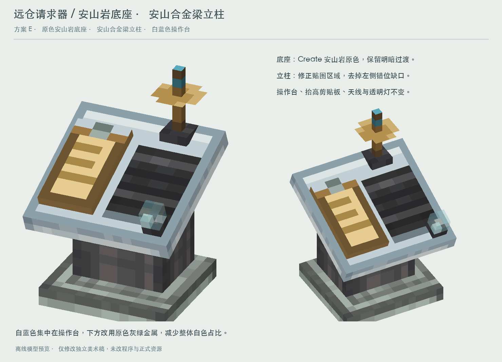

# 远仓请求器美术交接：用户已确认 v5

交接日期：2026-09-14。接收方：CherryStudio 中负责 DistantStock 程序开发的 v4.1f。

此前文件只在 Codex 独立美术工作目录，所以在工程里看不到。本目录现已将确认版复制进工程，但**没有接入游戏，没有修改程序、注册、碰撞或正式资源，也没有提交或推送**。

## 先看这个



用户在立柱贴图修复后的 v5 明确表示“满意”。请以此为视觉基准，不使用旧 T 字天线、画有 02/OK 字样的台面或全白底座版本。

## 已确认的设计

- 这是有自带底座的放置式远仓请求器，不是便携式请求器，也不是远仓仪表。希望适合独立摆放在墙边或中控室角落。
- 上方是白灰淡蓝色斜操作台，台头旋转 -22.5°；不要增加细碎装饰或改变像素密度。
- 左侧剪贴板为独立薄层，沿台头局部法线高出 1 模型像素，即 1/16 格。保留纸张、书写痕迹和金属夹。
- 右侧使用 Create `flap_display_front` 深灰横向条带；**文字不烘焙在材质里**。若后续显示字符，应单独动态绘制，具体信息和动画尚未定稿。
- 天线复用项目现有便携式请求器中的 `AntennaX`、`AntennaZ`、`Dish`、`AntennaTop`，包含反射碗，整体改为竖直。不是重新画的 T 字杆。
- 角落保留 2×2×2 模型像素的透明小灯罩。具体灯色/闪烁业务映射尚未确定。
- 底座使用 Create `andesite_block` 原色纹理；中间立柱使用柴油动力（Create: Diesel Generators）的安山合金梁纹理。
- **v5 修复重点**：梁纹理图集右半边包含透明附件区域，不能整张铺到立柱。侧面只采样左侧不透明 8 像素宽梁面；正面通过重复中间两列扩展到 10 像素，保留两端边缘。不要退回 v4 的透明缺口。

## 文件清单与使用边界

| 文件 | 内容 |
|---|---|
| `requester_design_sheet.png` | 已确认的双视角展示图 |
| `requester_front.png`、`requester_alt.png` | 无文字单独渲染图 |
| `console_body.json` | 8 个机身体块的 Minecraft 风格几何、UV 与旋转，不包含完整天线，纹理命名空间仍是预览用 `requester_study` |
| `preview_mesh.json` | 完整 63 面预览网格，含变换后的天线；不是 Minecraft 可直接加载的模型 JSON |
| `textures/` | 渲染所需的全部本地材质，包括便携式请求器贴图快照 |
| `portable_requester_reference.json` | 交接时工程中的便携式请求器模型快照，仅用作天线来源，不要覆盖便携式物品 |
| `renderer/render_preview.py` | 读取完整网格和本地材质重新渲染，不依赖 Codex 目录或游戏 jar |
| `renderer/render_scene.py` | 项目现有离线渲染器的快照 |

## 几何与接入提示

坐标单位是模型像素，16 单位为 1 格。以下几何仅是美术设计，不代表已经确定游戏碰撞。

| 部件 | from → to |
|---|---|
| 底脚 | `[1,0,2]` → `[15,2,15]` |
| 立柱 | `[3,2,6]` → `[13,12,14]` |
| 台头（旋转前） | `[0,12,0]` → `[16,14,16]` |
| 剪贴板（旋转前） | `[1,14,2]` → `[7,15,13]` |
| 透明灯（旋转前） | `[13,15,1]` → `[15,17,3]` |

台头、剪贴板、灯组件统一绕 `[8,13,8]` 的 X 轴旋转 -22.5°。其他部件详见 JSON。

原便携式天线坐标 `(x,y,z)` 在预览中刚性转换为 `(x+7,18-z,y+12.6)`，保持原 UV。完整高度至 y=25，即含天线约 25/16 格；天线是否参与碰撞、上方空间检查、方块朝向及放置规则需要程序侧决定，不能视为已测试。

接入时请：

1. 先核对当前工程实际的放置式请求器注册与模型路径，不要误改 `requester` 便携式物品或远仓仪表。
2. 将完整天线变换转换为有效的游戏模型/独立部件，正确处理面朝向与 UV；不要直接把预览 mesh 当作 block model。
3. 区分不透明机身、透明灯罩和可能的动态字符。不要为透明灯罩把整个机身都错误地改为透明，也不要丢失透明度。
4. 保持本轮已确认外观；保留现有程序逻辑和其他开发者改动。本交接不授权无关重构。
5. 接入后在游戏验证四个水平方向、物品栏图标、贴墙摆放、灯罩透明度、模型缺失告警及立柱 UV。离线渲染成功不等同于游戏内测试通过。

## 材质来源与发布注意

台头：Create 安山岩纹理灰阶映射白蓝色；底座：Create 安山岩原色；翻牌：Create 原生条带裁取。剪贴板是本轮的简化像素绘制。

便携式天线源文件注明 Create: Mobile Packages、MIT、Tim Heidler，应保留相关署名和许可证要求。安山合金梁来自本机 `createdieselgenerators-1.21.1-1.3.11.jar`；**本轮尚未审核该贴图的分发许可**。这些文件作为本地参考美术交接，正式发布前需核对相关素材许可，必要时制作自有等效素材，不要因本地存在就默认可分发。

## 本地再渲染

需要 Python 3、Pillow、NumPy。在本目录运行：

```sh
python3 renderer/render_preview.py
```

结果位于 `verification/`，不覆盖确认图。无需绝对路径、外部 jar 或此前 v2/v3/v4/v5 生成脚本。
