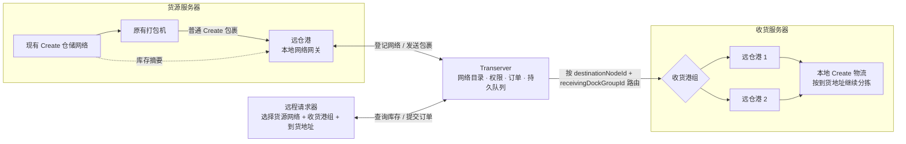

# 远仓路由 v1

本文件只冻结已经确认的跨服路由规则，不决定互通塔、流体或材料命名。

## 稳定身份

- 服务器以 Transerver 提供的 UUID 作为 `nodeId`。
- 仓储网络使用全局 `networkId`，由 `nodeId + worldId + dimensionId + Create freq` 确定；不同服务器或世界中偶然相同的 Create 频率不得冲突。
- 收货港组使用独立 UUID；玩家看到的是可修改的显示名。
- IP、域名、端口、ZeroTier 地址和 Router URL 只存在于配置中。
- 修改服务器地址、服务器别名、仓储网络显示名或港组名称，不会使已绑定的请求器和运输中的旧包裹失效。

## 概念边界

- **仓储网络**回答“从哪里查询和取出物品”，对应货源端的 Create 物流网络。
- **远仓港**既是包裹的物理输入/输出设备，也是本地仓储网络接入 Transerver 的网关；不再增加独立的“远仓仓储链接器”。
- **收货港组**回答“跨服包裹从哪里出来”，由同一服务器上的一个或多个远仓港组成。
- **本地包裹地址**只回答“包裹到达目标服务器后去哪里”，继续使用 Create 地址系统。
- 仓储网络与收货港组不永久结对；每份订单明确选择一个货源网络和一个收货港组。

## 远仓港作为网关

1. 远仓港在货源服务器内按 Create 规则绑定一个本地仓储网络。
2. 远仓港将该网络的 `networkId`、显示名、库存摘要和在线状态登记到 Transerver。
3. 同一仓储网络可以部署多个远仓港；它们是同一网关的多个物理入口，不得重复计算或重复发布库存。
4. 原有仓储链接器、保险库、打包机和生产线无需替换；远仓打包机是可选的专用外观/便利设备，不是跨服运输的必要条件。
5. 原版打包机生成的普通 Create 包裹抵达远仓港后，由远仓港依据订单上下文补充跨服路由并提交给 Transerver。

## 请求器跨服绑定

- 请求器不跨服操作 Create 的绑定工具，也不保存 IP、端口或裸 `freq`；它保存 Transerver 管理的 `networkId`。
- 未绑定请求器从 Transerver 获取玩家有权访问的仓储网络目录，玩家选择网络后完成绑定。
- 网络可采用公开、指定服务器共享或一次性/限时配对码授权；配对码只授予访问权，不作为永久地址。
- 请求器界面的核心字段为“货源网络”“收货港组”“到货地址”。源端远仓港的内部回收地址由系统管理，不让玩家手填。
- 一个请求器可以获权访问多个仓储网络；V1 每份订单只选择一个货源网络，不自动跨网络拆单。

## 多对多规则

- 一个仓储网络可以服务多个服务器上的请求器，并把不同订单发往不同收货港组。
- 一个发送远仓港可以根据包裹路由发送到任意已授权的远程收货港组，不与某个接收港永久配对。
- 一个收货港组可以包含多个接收远仓港，并在组内进行轮转或按可用空间选择。
- 多个仓储网络可以向同一个收货港组供货。
- V1 不合并多个仓储网络的库存，也不把一份订单自动拆分到多个货源网络；该能力留待明确部分成功、回滚和幂等规则后实现。

## 异构模组与物品兼容性

不同服务器允许安装不同模组，但“链路可连接”不等于“任意物品均可送达”。Transerver 和 DistantStock 必须在移除源端包裹前完成目标端预检。

### 节点能力

每个节点登记以下能力摘要：

- Minecraft 版本、加载器和 DistantStock 协议版本范围；
- 已安装模组的 `modId`、版本和注册表指纹；
- 允许/拒绝跨服传输的物品策略；
- 当前能够接收的物品与数据组件格式。

V1 默认采用保守策略：Minecraft 主版本和远仓协议必须兼容；模组物品默认要求目标服存在相同物品 ID，且来源模组版本与数据组件格式通过目标端实际解码预检。管理员可以通过后续适配器放宽特定模组版本范围，但不得默认丢弃未知数据组件或自动替换成其他物品。

### 发送前预检

1. 源端只向 Transerver 提交包裹清单、序列化格式版本、哈希和目标港组，不立即删除实体包裹。
2. 目标节点验证包裹本体、包裹内所有 `ItemStack`、数据组件和嵌套内容能否完整解码，并返回一次性的 `prepareToken` 或明确拒绝原因。
3. 只有收到 `ACCEPTED + prepareToken`，源端才将包裹移入持久发件箱并开始消耗/结算传输资源。
4. 目标端必须先把完整载荷写入持久收件箱，再确认接收；所有确认按 `parcelId` 幂等，重复请求不得生成第二份物品。

远程请求器应根据目标节点能力隐藏或标红不兼容物品，尽量在下单前阻止必然失败的订单；手动塞入远仓港的包裹仍必须执行同样的发送前预检。

### 拒收、回退与隔离

- **发送前不兼容**：原包裹留在发送远仓港，不消耗流体；设备显示拒收原因，并允许从退件面取回。
- **排队期间目标服变更模组**：Transerver 将原始不透明载荷标记为 `RETURNING`，按来源 `nodeId + originDockGroupId` 原路退回，不在中间节点解码或改写。
- **源服暂时离线**：退件保留在 Transerver 的持久队列中，等待来源节点恢复。
- **来源节点也永久不兼容或被删除**：进入管理员可见的 `QUARANTINED` 隔离库，可重试或导出；不得静默删除、变成空气或替换为屏障方块。
- 任何达到重试上限的包裹只能改变为 `RETURNING` 或 `QUARANTINED`，不能从队列中直接丢弃。

建议状态机：

```text
CREATED -> PREPARING -> PREPARED -> IN_TRANSIT -> DELIVERED
               |                         |
               +-> REJECTED              +-> RETURNING -> RETURNED
                                                   |
                                                   +-> QUARANTINED
```

标准拒绝原因至少包含：`MISSING_ITEM`、`MOD_VERSION_MISMATCH`、`UNSUPPORTED_COMPONENT`、`ITEM_DENIED`、`PAYLOAD_TOO_LARGE` 和 `PROTOCOL_INCOMPATIBLE`。

## 玩家流程



## 订单和包裹

请求器提交订单时选择一个收货港组。远仓业务路由包含：

- `schemaVersion`
- `destinationNodeId`
- `receivingDockGroupId`
- `correlationId`
- `childOrderId`

Create 自己的包裹地址继续保留，用于包裹抵达目标服务器后的本地物流分拣；它不承担跨服寻址。

## 收货港组

- 一个港组可以包含同一服务器上的多个远仓港。
- 送达时只在指定组内选择已加载、已激活且有空间的接收港。
- 多个可用港之间采用轮转分配，避免所有包裹挤入同一台设备。
- 指定组暂时无空间时返回 `RETRY`，包裹留在 Transerver 的持久队列中。
- 不自动改投其他港组，也不把未知节点回退到“第一个服务器”。
- 双向远仓港的发送缓存和接收缓存必须分离，防止包裹回环。

## 实施顺序

1. 定义全局 `networkId`、路由值对象与频道常量。
2. 让远仓港绑定本地 Create 网络，并以网关身份向 Transerver 登记和续租。
3. 增加网络目录、访问权限与公开/服务器共享/配对码授权。
4. 将请求器从裸 `freq` 迁移到 `networkId`，完成货源网络选择 UI。
5. 完成港组保存、重命名、同步、选择 UI 和组内选择器。
6. 远仓包裹数据组件，以及普通 Create 包裹在远仓港边界处的路由封装。
7. Transerver 适配器与旧 HTTP 链路迁移。
8. 验证多服务器、多世界、同网多港、断线重试和重复投递场景。
